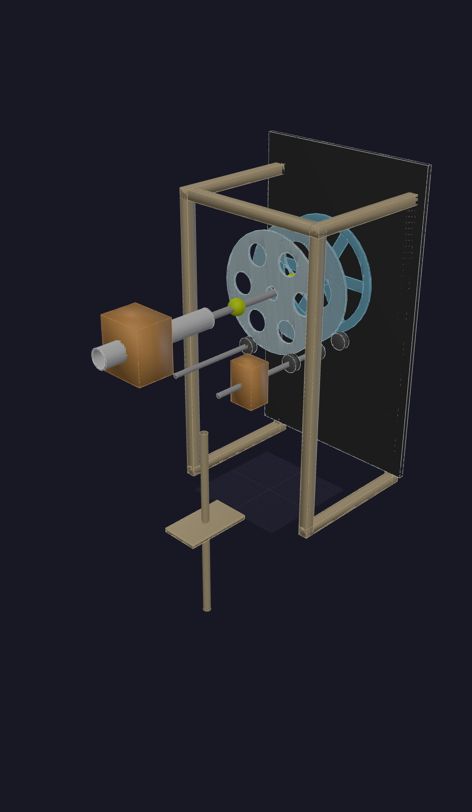

# Whiffle Ball Carnival Shooter

Leaf blower powered PVC cannon fires 3" whiffle balls through a stack of slowly counter-rotating
plexiglass discs on a shared central axis.

---

## Core Concept (v2 — Spinning Disc Stack)

The game is a **depth + timing challenge**. A handheld or stand-mounted leaf blower feeds a PVC tube
that blasts neon whiffle balls horizontally through 3–4 circular plexiglass discs mounted on a
single horizontal shaft. Each disc has a different hole pattern cut into it, and adjacent discs spin
in **opposite directions** at slow, constant speed.

To score, the ball must thread through aligned openings in all spinning discs simultaneously. Because
each disc rotates against its neighbor, there are brief windows of alignment — getting deeper means
threading multiple moving gaps at once. The chaotic rattling of a ball that clears the first disc
but ricochets off the second is half the fun.

A black chalkboard backdrop provides contrast for the neon balls and carries chalk marker art, the
game name, and scoring zone labels.

---

## The Disc Stack

### Disc design options (from sketches)

| Name | Pattern | Open Area | Difficulty |
|---|---|---|---|
| **Ring** | 6–7 circles in a ring around a center hole | High | Front / easiest |
| **Clover** | 4 large petal-shaped lobes (+ cross gaps) | High-medium | Front-mid |
| **Quad-spoke** | 4 wide pie-slice openings, thick hub + spokes | Medium | Mid |
| **Hex-spoke** | 6 narrow pie-slice openings, thick spokes | Low | Back / hardest |
| **Bull's-eye** | Single large center hole | Very high | Novelty / warmup |

The progression front-to-back: lots of open area with generous holes → fewer, narrower openings that
require the ball to be precisely on-axis. The back disc's spokes should leave just 5–10mm clearance
per side for a 3" (76mm) ball.

### Rotation

- Discs spin slowly on a shared **horizontal shaft** (the shoot axis = +Y in the model)
- Adjacent discs rotate in **opposite directions** — e.g. disc 1 CW, disc 2 CCW, disc 3 CW
- Speed: slow enough for a player to read the gap, fast enough that timing matters (~5–15 RPM)
- Driven by a small motor at one end (or a hand-crank for the analog version)
- Each disc may be geared/belted to the next with a simple direction-reversal per stage

### Disc dimensions

| Parameter | Value | Notes |
|---|---|---|
| Disc diameter | 500–600mm (20–24") | Fits 3" ball + 4–6" clearance to edge |
| Disc thickness | 6–10mm | Clear cast acrylic or polycarbonate |
| Spacing between discs | 150–200mm (6–8") | Enough for a ball to bounce freely between layers |
| Shaft diameter | 25–32mm | Steel rod or pipe |
| Spoke/web min width | 80–100mm | Wide enough to structurally hold the disc |
| Hole clearance (back disc) | ~5mm per side | 86mm opening for 76mm ball |

---

## Frame & Mounting

- Simple **A-frame or rectangular box frame** in 2×4 lumber or steel square tube
- Shaft mounted horizontally through **pillow-block bearings** at each end
- Frame height: disc center at ~900–1100mm (waist-to-chest height for shooting)
- Frame depth: shaft length = (number of discs × spacing) + bearing overhangs
- Discs hang/slot onto the shaft via set-screw hubs or keyed shaft sections
- Optional: removable discs for easy transport / configurable difficulty

---

## The Cannon

- **Leaf blower** (handheld — Ryobi, EGO, or similar cordless) fitted with a **PVC adapter cone**
- Cone narrows the blower output to match the PVC tube bore (~80mm ID for 3" balls)
- PVC tube: ~600–900mm long, supported on a **V-notch rest or cradle** on the counter/table
- Ball feed: drop balls in the back of the tube — blower pressure fires one at a time
- Optional ball hopper: a vertical clear tube above the breach lets you stack 4–6 balls

---

## Backdrop

- **2×4ft black chalkboard panels** (or painted MDF/hardboard) behind the disc stack
- Positioned ~150–200mm behind the last disc
- Decorated with chalk marker art: game name, scoring tiers, "AIM FOR DEPTH!", target rings
- High contrast for neon yellow-green (or pink) balls in flight

---

## Scoring Zones (conceptual)

| Depth cleared | Points | Label on chalkboard |
|---|---|---|
| Front disc only | 1 pt | "LEVEL 1" |
| First + second disc | 3 pts | "LEVEL 2" |
| All 3 discs | 10 pts | "DEPTH MASTER!" |
| All discs + bull's-eye center | 25 pts | "JACKPOT" |

---

## Key Dimensions

| Parameter | Default | Range | Notes |
|---|---|---|---|
| Disc Diameter | 550mm | 450–650mm | Cut from 24"×24" plexi sheet |
| Disc Thickness | 8mm | 6–10mm | Cast acrylic |
| Disc Count | 3 | 2–4 | More = harder |
| Layer Spacing | 165mm | 130–220mm | ~6.5" |
| Shaft Diameter | 28mm | 25–35mm | Steel rod |
| Ball Diameter | 76mm | 70–82mm | Standard 3" whiffle |
| Rotation Speed | 8 RPM | 3–20 RPM | Motor-controlled |

---

## Build Log

### Session 2026-03-29 — v1 (rectangular panels)
- Initial rectangular panel model: 3 plexiglass panels, 4-post frame, PVC cannon + leaf blower
- Screenshot: 
- Status: superseded by v2 disc concept

### Session 2026-03-29 — v2 concept (spinning disc stack)
- Major pivot: rectangular panels → circular rotating discs on central axis
- Inspired by reference photos and hand sketches
- Disc patterns: ring, clover, quad-spoke, hex-spoke (front-to-back = easy-to-hard)
- Added rotation mechanic: adjacent discs counter-rotate for timing challenge
- Status: concept documented — 3D model iteration next
